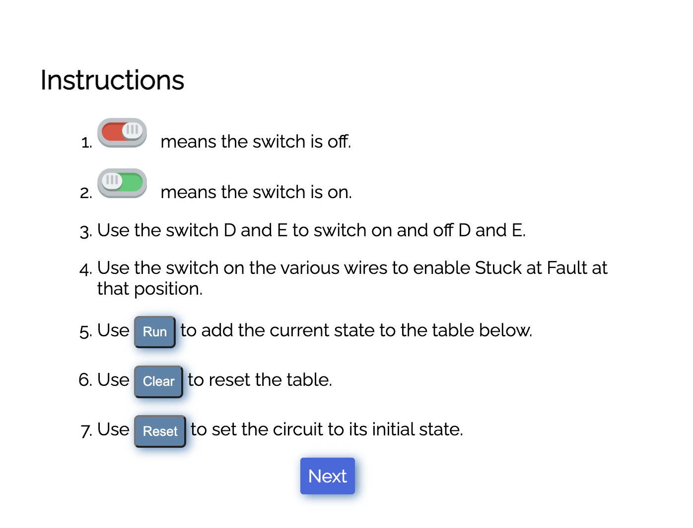
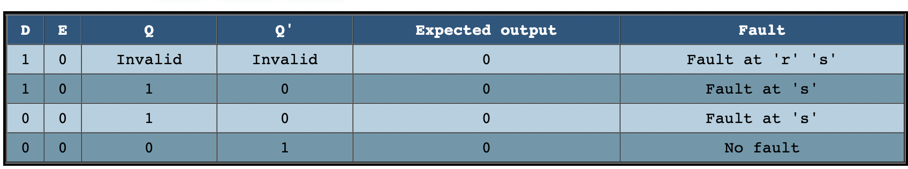

## These procedure steps will be followed on the simulator

 
1. When you open Procedure tab on navigation bar, a window will open as shown below, read it to understand the terminologies, click on Next button to proceed to the simulation.
 
    

2. A simulator will open as shown below. 
    

3. The red button shown below signifies that the swith is off. You can toggle it turn the switch on 
    

4. The green button shown below signifies that the swith is off. You can toggle it to turn the switch off. 
    

5. You can use these switches on various wires to enable stuck at faults at that position. 

6. Use run to add the current state, clear to reset the table and reset to set the circuit to its initial state. 
    

7. You can find the struck at fault positions(if there are any) in the table shown below. 
    
